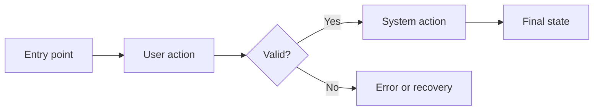

# Linear issue templates

Copy each body into a new Linear issue template in the UI (Settings → Templates). These mirror the
shapes cape produces, so a human creating an issue by hand gets the same form. Cape cannot apply
them itself: the Linear MCP server's `save_issue` takes raw markdown and exposes no template field.
The agent contract in [SKILL.md](../SKILL.md) enforces the shape; these templates are a human-side
convenience.

These templates are the canonical epic and task shapes. The authoring sources mirror them: epic and
task are produced by `cape:write-plan`, bug by `cape:fix-bug`. Design rationale and discovery stay
in session, not on the board.

The epic body separates four questions that must never blend:

| Section                  | Answers                                                      |
| ------------------------ | ------------------------------------------------------------ |
| **Required behavior**    | What must become true; testable, observable outcomes (R-IDs) |
| **Required constraints** | Already-settled boundaries the agent may not cross           |
| **Proposed approach**    | A recommendation the agent may improve                       |
| **Acceptance criteria**  | Evidence the work is done                                    |

Pick a variant per epic. Default to **Light**. Use **Full** when a user journey changes, a new state
or lifecycle exists, a migration runs, authorization matters, multiple systems or teams are
involved, or rollout, observability, or rollback matters.

## Epic — Light (default)

Untyped parent. No `type:*` label. Set `src:*` and Medium priority as template defaults.

```markdown
## 🧭 At a glance

| Field             | Value                               |
| ----------------- | ----------------------------------- |
| **Outcome**       | [What is true after this]           |
| **Problem**       | [What is wrong or missing]          |
| **User / system** | [Who benefits]                      |
| **Variant**       | Light                               |
| **Done when**     | [One concrete completion statement] |

## Required behavior

| ID  | Scenario               | Expected result                     |
| --- | ---------------------- | ----------------------------------- |
| R1  | [When actor does X]    | [Observable state, value, or event] |
| R2  | [Edge or failure case] | [Observable state, value, or event] |

## Required constraints

- [Settled decision, boundary, or compatibility rule; or "N/A (single task)"]
- NO [pattern] (reason: [why])

## Proposed approach

[2-3 paragraphs the agent may improve: chosen path referencing codebase patterns, key components,
and data flow. Mermaid for flows over ~3 steps.]

## Acceptance criteria

- [ ] R1 verified with evidence.
- [ ] R2 verified with evidence.
- [ ] Existing behavior outside scope is unchanged.
```

## Epic — Full

Light plus the alignment sections. Same untyped-parent rules.

````markdown
## 🧭 At a glance

| Field            | Value                               |
| ---------------- | ----------------------------------- |
| **Outcome**      | [What is true after this]           |
| **Problem**      | [What is wrong or missing]          |
| **Primary user** | [User, persona, or system]          |
| **Risk**         | Low / Medium / High                 |
| **Variant**      | Full                                |
| **Done when**    | [One concrete completion statement] |

## Before / after

| Before             | After               |
| ------------------ | ------------------- |
| [Current behavior] | [Expected behavior] |

## Required behavior

| ID  | Scenario                         | Expected result                     |
| --- | -------------------------------- | ----------------------------------- |
| R1  | [Primary success path]           | [Observable state, value, or event] |
| R2  | [Reload, retry, or failure case] | [Observable state, value, or event] |
| R3  | [Permission or security case]    | [Expected restriction]              |

## User journey


````

## Required constraints

- [Settled decision, boundary, or compatibility rule]
- NO [pattern] (reason: [why])

## Proposed approach

[2-3 paragraphs the agent may improve: chosen path, key components, data flow, known risks.]

## Acceptance criteria

- [ ] R1 verified with evidence.
- [ ] R2 verified with evidence.
- [ ] R3 verified with evidence.
- [ ] Existing behavior outside scope is unchanged.

## Release and observability

| Item               | Plan                                |
| ------------------ | ----------------------------------- |
| **Rollout**        | [Immediate / feature flag / phased] |
| **Rollback**       | [How to disable or revert]          |
| **Success signal** | [Metric, event, or support signal]  |
| **Failure signal** | [Error rate, stuck state, or alert] |

## Dependencies and risks

| Item         | Type       | Status / mitigation       |
| ------------ | ---------- | ------------------------- |
| [Dependency] | Dependency | [Ready / blocked / owner] |
| [Risk]       | Risk       | [Mitigation]              |

## Work breakdown (sketch, not pre-created)

| Subtask   | Delivers | Notes      |
| --------- | -------- | ---------- |
| [Slice 1] | R1, R3   | [Boundary] |
| [Slice 2] | R2       | [Boundary] |

````

The work breakdown is a non-binding sketch; do not pre-create these as sub-issues. `cape:execute-plan`
creates each one lazily, after the previous task reveals what it should be.

## Task

Set exactly one `type:*`, `src:*`, and Medium priority as template defaults.

```markdown
## Goal

[One vertical slice]

Delivers: R1, R2

## Interface

- Inputs:
- Outputs:
- Side effects:

## Execution mode

[HITL | AFK]

Done when: [load-bearing completion condition]

## Success criteria

- [ ] [Objective check]

## References

- [file:line — verified pattern or helper]
````

## Bug

Set `type:bug`, `src:*`, and Medium priority as template defaults. Title as `Fix <symptom>`.

```markdown
## Root cause

[file:line — mechanism]

## Evidence

- [Key observation]

## Reproduction

1. [Exact step]

## Expected behavior

[What should happen]

## Actual behavior

[What happens]

## Suggested fix

[Approach]

Done when: [symptom no longer reproduces]

## Success criteria

- [ ] [Reproduction test passes]
```
