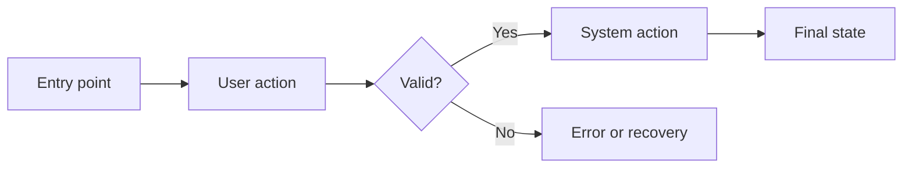

# Linear issue templates

These bodies mirror the shapes cape produces: human ticket, plan issue, and task by
`cape:write-plan`, bug by `cape:fix-bug`. To give hand-authored issues the same form, copy each body
into a Linear issue template (Settings → Templates); cape cannot apply them itself, since
`save_issue` takes raw markdown and exposes no template field. Every template sets a `src` label and
Medium priority as defaults; tasks and bugs add a `type` label as noted.

## Human ticket

The repo's home team. Description only: no R-tables, no constraints, no acceptance criteria. The
human tier exists to be scannable. Untyped parent.

```markdown
[What changes and why, in 2-4 sentences a human can scan in ten seconds.]

Done when: [one concrete completion statement]
```

## Plan issue

`AI` team. Untyped parent of the task sub-issues, and itself a sub-issue of the human ticket it
satisfies, or parentless when AI-only.

Pick a variant per plan issue. Default to **Light**. Use **Full** when a user journey changes, a new
state or lifecycle exists, a migration runs, authorization matters, multiple systems or teams are
involved, or rollout, observability, or rollback matters.

Scale Light to the change. For a few-line change, the plan issue is the description, one R row, and
one acceptance line.

### Plan issue, Light (default)

```markdown
## At a glance

| Field             | Value                               |
| ----------------- | ----------------------------------- |
| **Outcome**       | [What is true after this]           |
| **Problem**       | [What is wrong or missing]          |
| **User / system** | [Who benefits]                      |
| **Variant**       | Light                               |
| **Done when**     | [One concrete completion statement] |

## Required behavior

| ID  | Scenario               | Expected result                     |
| --- | ---------------------- | ----------------------------------- |
| R1  | [When actor does X]    | [Observable state, value, or event] |
| R2  | [Edge or failure case] | [Observable state, value, or event] |

## Required constraints

- [Settled decision, boundary, or compatibility rule]
- NO [pattern] (reason: [why])

## Proposed approach

[2-3 paragraphs the agent may improve: chosen path referencing codebase patterns, key components,
and data flow. Mermaid only for branching flows; a straight-line pipeline stays prose.]

## Acceptance criteria

- [ ] [R1: the command or observation that proves it]
- [ ] Existing behavior outside scope is unchanged.
```

### Plan issue, Full

Light plus the alignment sections. Same untyped-parent rules.

````markdown
## At a glance

| Field            | Value                               |
| ---------------- | ----------------------------------- |
| **Outcome**      | [What is true after this]           |
| **Problem**      | [What is wrong or missing]          |
| **Primary user** | [User, persona, or system]          |
| **Risk**         | Low / Medium / High                 |
| **Variant**      | Full                                |
| **Done when**    | [One concrete completion statement] |

## Before / after

Before: [current behavior]. After: [expected behavior].

## Required behavior

| ID  | Scenario                         | Expected result                     |
| --- | -------------------------------- | ----------------------------------- |
| R1  | [Primary success path]           | [Observable state, value, or event] |
| R2  | [Reload, retry, or failure case] | [Observable state, value, or event] |
| R3  | [Permission or security case]    | [Expected restriction]              |

## User journey


```mermaid
flowchart LR
    A[Entry point] --> B[User action]
    B --> C{Valid?}
    C -->|Yes| D[System action]
    C -->|No| E[Error or recovery]
    D --> F[Final state]
```

## Required constraints

- [Settled decision, boundary, or compatibility rule]
- NO [pattern] (reason: [why])

## Proposed approach

[2-3 paragraphs the agent may improve: chosen path, key components, data flow, known risks.]

## Acceptance criteria

- [ ] [R1: the command or observation that proves it]
- [ ] Existing behavior outside scope is unchanged.

## Release and observability

| Item               | Plan                                |
| ------------------ | ----------------------------------- |
| **Rollout**        | [Immediate / feature flag / phased] |
| **Rollback**       | [How to disable or revert]          |
| **Success signal** | [Metric, event, or support signal]  |
| **Failure signal** | [Error rate, stuck state, or alert] |

## Dependencies and risks

| Item         | Type       | Status / mitigation       |
| ------------ | ---------- | ------------------------- |
| [Dependency] | Dependency | [Ready / blocked / owner] |
| [Risk]       | Risk       | [Mitigation]              |

## Work breakdown (sketch, not pre-created)

| Subtask   | Delivers | Notes      |
| --------- | -------- | ---------- |
| [Slice 1] | R1, R3   | [Boundary] |
| [Slice 2] | R2       | [Boundary] |
````

`cape:execute-plan` creates each work-breakdown row lazily, after the previous task reveals what it
should be.

## Task

Sub-issue of the plan issue, `AI` team. Set exactly one `type` label.

```markdown
## Goal

[One vertical slice]

Delivers: R1, R2

## Interface

- Inputs:
- Outputs:
- Side effects:

## Execution mode

[HITL (user reviews each step) | AFK (unattended)]

Done when: [one concrete completion statement]

## Success criteria

- [ ] [Objective check]

## References

- [file:line, verified pattern or helper]
```

## Bug

Set the `bug` type label. Title as `Fix <symptom>`.

```markdown
## Root cause

[file:line, mechanism]

## Evidence

- [Key observation]

## Reproduction

1. [Exact step]

## Expected behavior

[What should happen]

## Actual behavior

[What happens]

## Suggested fix

[Approach]

Done when: [symptom no longer reproduces]

## Success criteria

- [ ] [Reproduction test passes]
```
